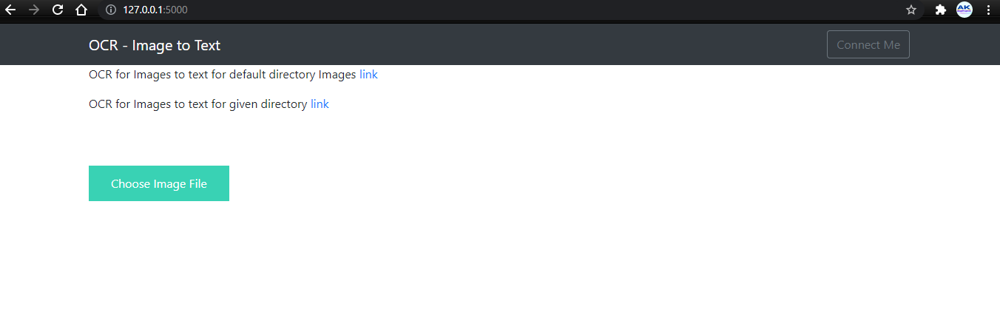
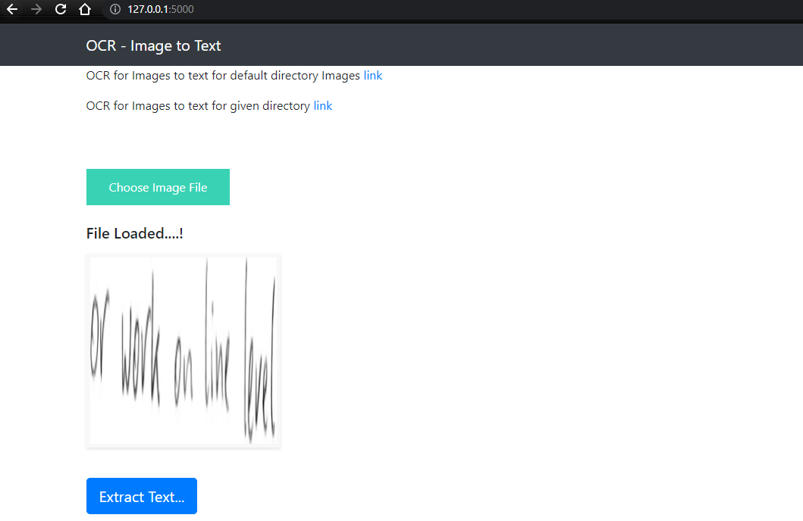
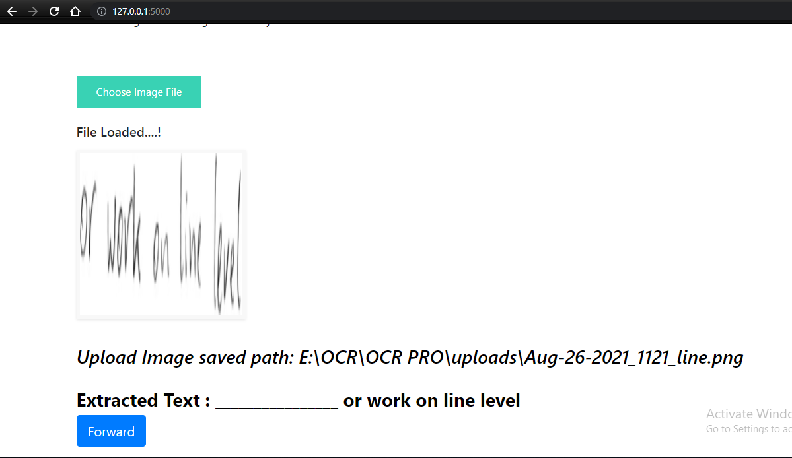
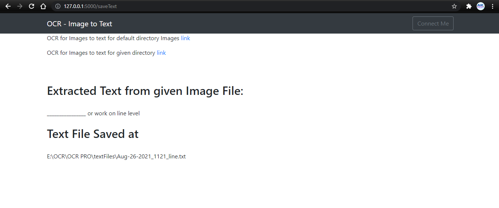
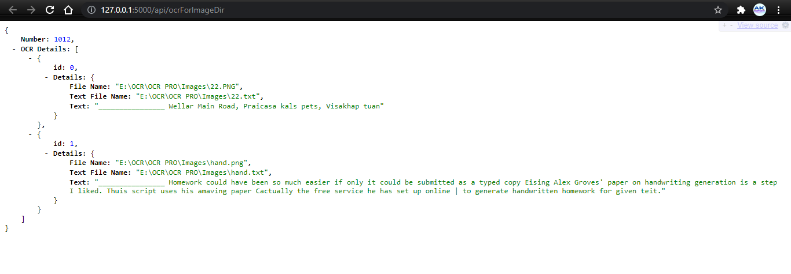
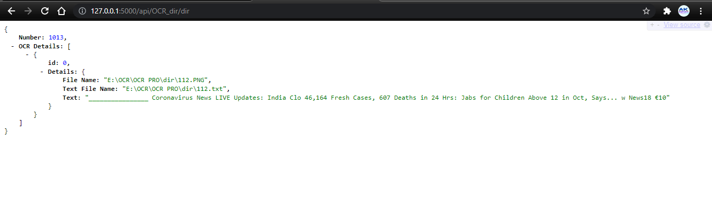
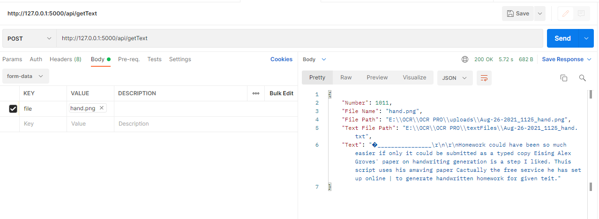

# OCR-Pro-Google-Service
Create flask App for OCR pro use Google Drive's OCR technology to extract text from Image, Create flask app and API for extract text. API for multiple images in default and specific directory.

-------
## Quickstart
follow steps from:
[https://developers.google.com/drive/api/v3/quickstart/python](https://developers.google.com/drive/api/v3/quickstart/python)

Go to [https://console.cloud.google.com/](https://console.cloud.google.com/)
and Enable Google Drive API and get credentials.

Run app1.py and give permission to Drive and save token.pickle file.
And now start Flask application.

--------
## Images

